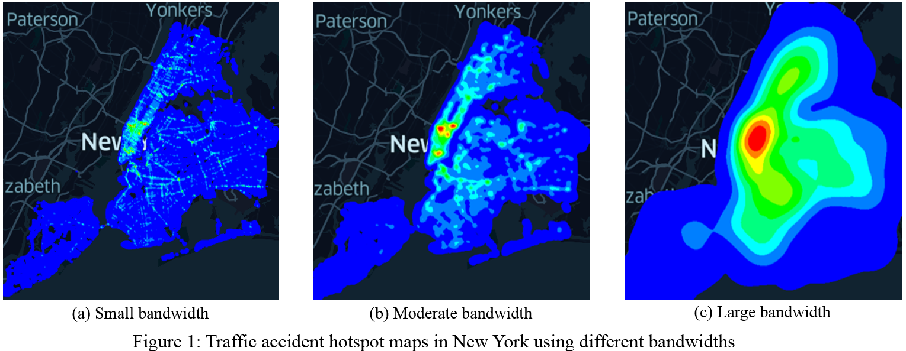

# LIBKDV - A Versatile Kernel Density Visualization Library for Geospatial Analytics
Kernel Density Visualization (KDV) has been extensively used for many geospatial analysis tasks. Some representative examples include traffic accident hotspot detection, crime hotspot detection, and disease outbreak detection. Although many scientific software packages, including Scipy and Scikit-learn, geographical software packages, including QGIS and ArcGIS, and visualization software packages, including Deck.gl and KDV-Explorer, can also support KDV, none of these tools, to the best of our knowledge, can be scalable to high resolution size (e.g., 2560 x 1920) and large-scale datasets (e.g., one million data points). Therefore, the huge computational cost limits the applicability of using the off-the-shelf software tools to support advanced (or more complex) geospatial analytics, e.g., bandwidth-tuning analysis and spatiotemporal analysis, which involves computing multiple KDVs in one batch.

# Introduction:
To overcome the above issue, we develop the first versatile programming library (LIBKDV), by combining our recent studies (SLAM [1] and SWS [2]), which can reduce the worst-case time complexity for supporting different types of KDV-based geospatial analytics, including:

(1)	Bandwidth-tuning analysis (cf. Figure 1): Domain experts can first set multiple bandwidths in a batch, and then generate multiple KDVs with respect to these bandwidths.

<p align="center"></p>

(2)	Spatiotemporal analysis (cf. Figure 2): Domain experts can leverage a more complex spatiotemporal kernel density function to generate time-dependent hotspot maps that correspond to different timestamps.

<p align="center"></p>

To further enhance the efficiency for these two tasks, we fully parallelize our methods, SLAM and SWS.

<!-- -->

# Installation Guidelines:

1. First, build the virtual environment in the Anaconda (recommended Python 3.9)
```
conda create -n libkdv python=3.9
```
2. Activate the virtual environment
```
conda activate libkdv
```
3. Install the dependencies and the library
``` 
conda install -c conda-forge geopandas keplergl notebook
pip install libkdv
```
4. Anticipated problem(s) and possible solution(s)
> *OSError: could not find or load spatialindex_c-64.dll*
```
pip install rtree==0.9.3
```

# How to Use:

1. Import LIBKDV and Pandas in your code
```
import libkdv
import pandas as pd
```

2. Create the LIBKDV object and compute the heatmap
```
libkdv_obj = kdv(dataset, KDV_type,
                 GPS=true, 
                 bandwidth_s=1000, row_pixels=800, col_pixels=640, 
                 bandwidth_t=6, t_pixels=32,
                 num_threads=8)
libkdv_obj.compute()
```
Required arguments
> dataset: **Pandas object**, *the dataset.*<br />
> KDV_type: **String**, KDV *- single KDV* or STKDV *- Spatio-Temporal KDV.*<br />

Optional arguments
> GPS: **Boolean**, **true** *- use geographic coordinate system * or false *- use transformed X and Y (evaluation.ipynb).*<br />
> bandwidth_s: **Float**, *the spatial bandwidth (in terms of meters), default is **1000**.*<br />
> row_pixels: **Integer**, *the number of grids in the x-axis, default is **800**.*<br />
> col_pixels: **Integer**, *the number of grids in the y-axis, default is **640**.*<br />
> bandwidth_t: **Float**, *the temporal bandwidth (in terms of days), default is **6**. **REQUIRED** if KDV_type="STKDV".*<br />
> t_pixels: **Integer**, *the number of grids in the t-axis, default is **32**. **REQUIRED** if KDV_type="STKDV".*<br />
> num_threads: **Integer**, *the number of threads, default is **8**.*<br />

Example for computing a single KDV:<br />
```
NewYork = pd.read_csv('./Datasets/New_York.csv')
traffic_kdv = kdv(NewYork,KDV_type="KDV",bandwidth_s=1000)
traffic_kdv.compute()
```
Example for supporting the bandwidth-tuning analysis task:<br />
```
bandwidths_traffic_kdv = [500,700,900,1100,1300,1500,1700,1900,2100,2300] #Set the bandwidths
result_traffic_kdv = [] #Stores the final results
traffic_kdv = kdv(NewYork,KDV_type="KDV")
for band in bandwidths_traffic_kdv:
    kdv_traffic_kdv.bandwidth_s = band
    result_traffic_kdv.append(traffic_kdv.compute())
```
Example for supporting the spatiotemporal analysis task:<br />
```
NewYork = pd.read_csv('./Datasets/New_York.csv')
traffic_kdv = kdv(NewYork,KDV_type="STKDV",bandwidth_s=1000,bandwidth_t=10)
traffic_kdv.compute()
```

3. Show the heatmaps by [KerplerGL](https://kepler.gl/)

To generate a single KDV or support the spatiotemporal analysis task, you can use the following code.
```
from keplergl import KeplerGl
map_traffic_kdv = KeplerGl(height=600, data={"data_1": traffic_kdv.result})
map_traffic_kdv
```

To support the bandwidth-tuning analysis task, you can use the following code.
```
from keplergl import KeplerGl
map_traffic_kdv_bands = KeplerGl(height=500)

for i in range(len(bandwidths_traffic_kdv)):
    map_traffic_kdv_bands.add_data(data=result_traffic_kdv[i], name='data_%d'%(i+1))
map_traffic_kdv_bands
```

# Sample datasets:
We offer three sample datasets for testing, which are (1) Seattle crime dataset [a], (2) New York traffic accident dataset [b], and (3) Ontario COVID-19 dataset [c]. The python code (data_processing.py) and the Jupyter notebook (data_processing.ipynb) for extracting these datasets are provided in this Github link.

[a] Seattle Open Data. https://data.seattle.gov/Public-Safety/SPD-Crime-Data-2008-Present/tazs-3rd5. <br />
[b] NYC Open Data. https://data.cityofnewyork.us/Public-Safety/Motor-Vehicle-Collisions-Crashes/h9gi-nx95. <br />
[c] Ontario Open Data. https://data.ontario.ca/dataset/confirmed-positive-cases-of-covid-19-in-ontario. <br />

# Advantages:
There are three main advantages for using our LIBKDV.<br />
***Easy-to-use software package:*** Domain experts only need to write a few lines of python codes for using our LIBKDV, which is as easy as using other python packages, including Scikit-learn and Scipy.<br />
***High efficiency:*** LIBKDV is the first library that can reduce the worst-case time complexity for generating KDV, which cannot be achieved by other software tools. Therefore, instead of calling the KDV function in other python packages (Scikit-learn and Scipy), domain experts can call our efficient KDV function in LIBKDV.<br />
***High versatility:*** Due to the high efficiency of LIBKDV, our library can support more KDV-based geospatial analysis tasks, including bandwidth-tuning analysis and spatiotemporal analysis, which cannot be natively and feasibly supported by other software tools.<br />

<!--Add Practical Performance -->
<!-- LIBKDV is superior to those KDV solutions in scientific library, scikit-learn and scipy, in terms of response time and functionality, espeically for high resolution (1k monitor) and large data cardinality (millions objects). As shown in our jupyter notebook example, LIBKDV is XX times faster than scipy and yyy times faster than scikit-learn on our testing workstation.-->


# Project Members:
[Prof. (Edison) Tsz Nam Chan](https://www.comp.hkbu.edu.hk/~edisonchan/), Hong Kong Baptist University<br />
Mr. Pak Lon Ip, Universiy of Macau<br />
Mr. Kaiyan Zhao, Universiy of Macau<br />
[Prof. (Ryan) Leong Hou U](https://www.fst.um.edu.mo/personal/ryanlhu/), Universiy of Macau<br />
[Prof. Byron Choi](https://www.comp.hkbu.edu.hk/~bchoi/), Hong Kong Baptist University<br />
[Prof. Jianliang Xu](https://www.comp.hkbu.edu.hk/~xujl/), Hong Kong Baptist University<br />

# Collaborators:
[Prof. Reynold Cheng](https://i.cs.hku.hk/~ckcheng/), The University of Hong Kong<br />
[Prof. (Ken) Man Lung Yiu](https://www4.comp.polyu.edu.hk/~csmlyiu/), Hong Kong Polytechnic University<br />
Dr. Zhe Li, Alibaba Cloud<br />
Mr. Ye Li, University of Macau<br />
Mr. Weng Hou Tong, University of Macau<br />
Mr. Shivansh Mittal, The University of Hong Kong

# Publications:
1. Tsz Nam Chan, Leong Hou U, Byron Choi, Jianliang Xu. SLAM: Efficient Sweep Line Algorithms for Kernel Density Visualization. Proceedings of ACM Conference on Management of Data (SIGMOD), 2022.
2. Tsz Nam Chan, Pak Lon Ip, Leong Hou U, Byron Choi, Jianliang Xu. SWS: A Complexity-Optimized Solution for Spatial-Temporal Kernel Density Visualization. Proceedings of the VLDB Endowment (PVLDB), 2022.
3. Tsz Nam Chan, Pak Lon Ip, Leong Hou U, Byron Choi, Jianliang Xu. SAFE: A Share-and-Aggregate Bandwidth Exploration Framework for Kernel Density Visualization. Proceedings of the VLDB Endowment (PVLDB), 2022.
4. Tsz Nam Chan, Pak Lon Ip, Leong Hou U, Weng Hou Tong, Shivansh Mittal, Ye Li, Reynold Cheng. KDV-Explorer: A Near Real-Time Kernel Density Visualization System for Spatial Analysis. Proceedings of the VLDB Endowment (PVLDB), 2021.
5. Tsz Nam Chan, Zhe Li, Leong Hou U, Jianliang Xu, Reynold Cheng. Fast Augmentation Algorithms for Network Kernel Density Visualization. Proceedings of the VLDB Endowment (PVLDB), 2021.
6. Tsz Nam Chan, Reynold Cheng, Man Lung Yiu. QUAD: Quadratic-Bound-based Kernel Density Visualization. Proceedings of ACM Conference on Management of Data (SIGMOD), 2020.
7. Tsz Nam Chan, Leong Hou U, Reynold Cheng, Man Lung Yiu, Shivansh Mittal. Efficient Algorithms for Kernel Aggregation Queries. IEEE Transactions on Knowledge and Data Engineering (TKDE).
8. Tsz Nam Chan, Man Lung Yiu, Leong Hou U. KARL: Fast Kernel Aggregation Queries. IEEE International Conference on Data Engineering (ICDE), 2019.
